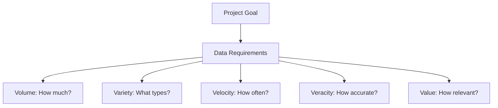
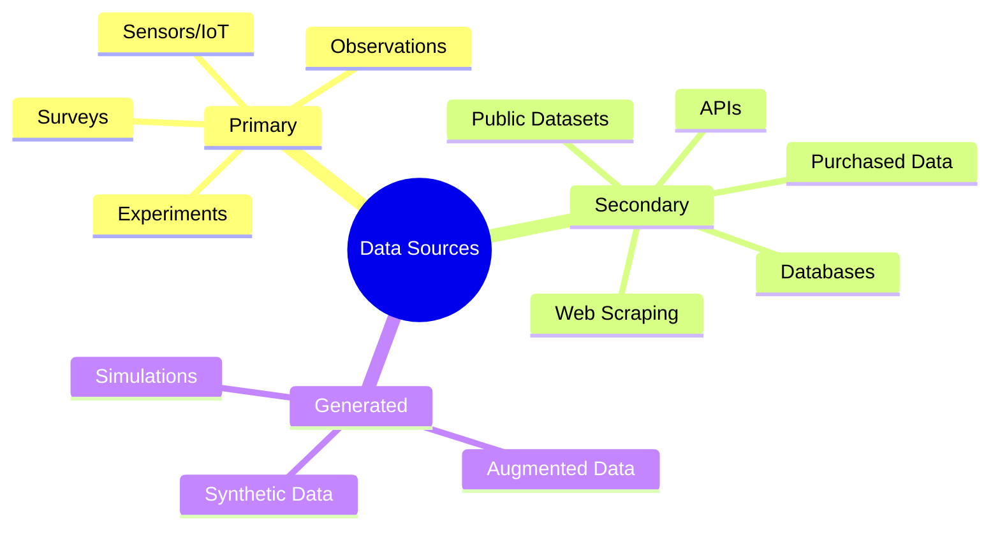
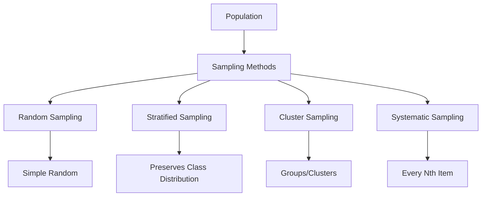
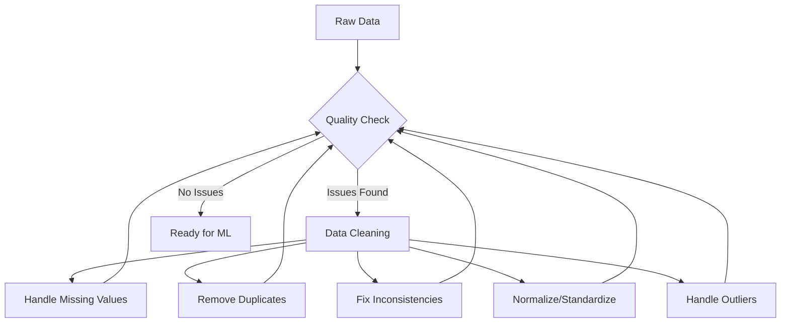
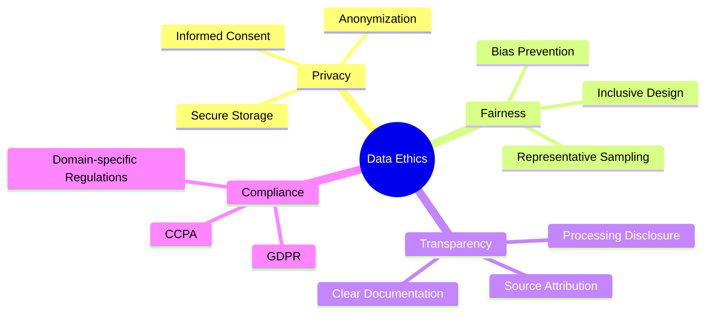
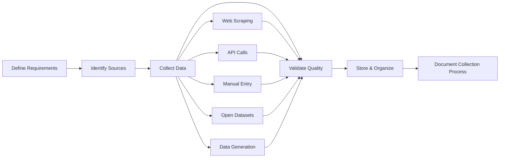

# Data Collection for Machine Learning

## Introduction

Data collection is a critical step in the machine learning pipeline. High-quality data leads to better models, while poor data can undermine even the most sophisticated algorithms. This lesson explores various methods and best practices for collecting data for machine learning projects.

## Table of Contents

1. [Understanding Data Requirements](#understanding-data-requirements)
2. [Types of Data Sources](#types-of-data-sources)
3. [Web Scraping](#web-scraping)
4. [Using APIs](#using-apis)
5. [Data Generation](#data-generation)
6. [Surveys and Forms](#surveys-and-forms)
7. [Open Datasets](#open-datasets)
8. [Data Sampling Techniques](#data-sampling-techniques)
9. [Data Quality Considerations](#data-quality-considerations)
10. [Ethical and Legal Considerations](#ethical-and-legal-considerations)
11. [Organizing Collected Data](#organizing-collected-data)
12. [Summary and Best Practices](#summary-and-best-practices)

## Understanding Data Requirements

Before collecting data, it's crucial to understand what you need:



### Key Questions to Ask:

1. What kind of data will help solve my problem?
2. How much data do I need?
3. What features should the data contain?
4. What is the ideal format for my model?
5. How balanced should the dataset be?

## Types of Data Sources



## Web Scraping

Web scraping involves extracting data from websites. It's useful when data is available online but not in a downloadable format.

### Basic Web Scraping with BeautifulSoup

```python
import requests
from bs4 import BeautifulSoup

# Send a request to the website
url = "https://example.com/data-page"
response = requests.get(url)

# Parse the HTML content
soup = BeautifulSoup(response.content, 'html.parser')

# Extract data
data_points = []
for item in soup.select('.data-item'):
    data_points.append({
        'title': item.select_one('.title').text.strip(),
        'value': item.select_one('.value').text.strip(),
        'category': item.get('data-category')
    })

# Convert to DataFrame
import pandas as pd
df = pd.DataFrame(data_points)
```

### Using Scrapy for Large-Scale Scraping

For more complex scraping needs, Scrapy provides a powerful framework:

```python
import scrapy

class DataSpider(scrapy.Spider):
    name = "data_spider"
    start_urls = ['https://example.com/page1']
    
    def parse(self, response):
        for item in response.css('.data-item'):
            yield {
                'title': item.css('.title::text').get().strip(),
                'value': item.css('.value::text').get().strip(),
                'category': item.attrib.get('data-category')
            }
            
        # Follow pagination links
        next_page = response.css('a.next-page::attr(href)').get()
        if next_page:
            yield response.follow(next_page, self.parse)
```

### Web Scraping Best Practices

1. **Respect robots.txt** files
2. **Include delays** between requests (e.g., `time.sleep(2)`)
3. **Identify your scraper** with proper User-Agent headers
4. **Handle errors gracefully**
5. **Cache results** to avoid redundant scraping

## Using APIs

APIs (Application Programming Interfaces) provide a structured way to access data.

### REST API Example

```python
import requests
import pandas as pd

# API endpoint
api_url = "https://api.example.com/data"

# Parameters for the request
params = {
    "category": "electronics",
    "limit": 100,
    "sort": "popularity"
}

# Headers (often needed for authentication)
headers = {
    "Authorization": "Bearer YOUR_API_KEY",
    "Content-Type": "application/json"
}

# Make the request
response = requests.get(api_url, params=params, headers=headers)

# Check if the request was successful
if response.status_code == 200:
    # Convert to DataFrame
    data = response.json()
    df = pd.DataFrame(data['items'])
    print(f"Collected {len(df)} records")
else:
    print(f"Error: {response.status_code}")
    print(response.text)
```

### Pagination with APIs

Many APIs limit the number of results per request, requiring pagination:

```python
all_data = []
page = 1
more_data = True

while more_data:
    params = {
        "page": page,
        "per_page": 100
    }
    
    response = requests.get(api_url, params=params, headers=headers)
    
    if response.status_code == 200:
        data = response.json()
        if data['items']:
            all_data.extend(data['items'])
            page += 1
            print(f"Collected page {page-1} with {len(data['items'])} items")
        else:
            more_data = False
    else:
        print(f"Error on page {page}: {response.status_code}")
        more_data = False

df = pd.DataFrame(all_data)
```

### Common APIs for Data Collection

1. **Twitter API** - Social media data
2. **Census APIs** - Demographic data
3. **Financial APIs** - Stock and economic data
4. **Weather APIs** - Climate and forecast data
5. **Google Analytics API** - Website traffic data

## Data Generation

Sometimes you need to generate data:

### Synthetic Data Generation

```python
import numpy as np
import pandas as pd

# Generate synthetic customer data
np.random.seed(42)  # For reproducibility

n_customers = 1000

# Generate customer data
customer_data = {
    'customer_id': np.arange(1, n_customers + 1),
    'age': np.random.normal(45, 15, n_customers).astype(int),
    'income': np.random.lognormal(10.5, 0.5, n_customers).astype(int),
    'spending_score': np.random.randint(1, 101, n_customers),
    'is_member': np.random.choice([0, 1], n_customers, p=[0.7, 0.3])
}

# Create correlations between variables
customer_data['purchase_frequency'] = (
    0.5 * customer_data['income'] / 10000 + 
    0.3 * customer_data['spending_score'] / 20 + 
    0.2 * customer_data['is_member'] * 5 +
    np.random.normal(0, 2, n_customers)
).clip(1, 30).astype(int)

# Convert to DataFrame
customers_df = pd.DataFrame(customer_data)
```

### Data Augmentation

For image data, augmentation creates variations:

```python
from tensorflow.keras.preprocessing.image import ImageDataGenerator

# Create an ImageDataGenerator
datagen = ImageDataGenerator(
    rotation_range=20,
    width_shift_range=0.2,
    height_shift_range=0.2,
    shear_range=0.2,
    zoom_range=0.2,
    horizontal_flip=True,
    fill_mode='nearest'
)

# Example with a single image
from tensorflow.keras.preprocessing.image import load_img, img_to_array

img = load_img('original_image.jpg')
x = img_to_array(img)
x = x.reshape((1,) + x.shape)

# Generate 5 new variations
i = 0
for batch in datagen.flow(x, batch_size=1, save_to_dir='augmented', 
                          save_prefix='aug', save_format='jpg'):
    i += 1
    if i >= 5:
        break
```

## Surveys and Forms

Custom data collection through surveys and forms:

### Using Google Forms with pandas

```python
import pandas as pd

# After exporting Google Forms responses to CSV
survey_data = pd.read_csv('survey_responses.csv')

# Basic cleaning
survey_data.columns = [col.lower().replace(' ', '_') for col in survey_data.columns]
survey_data = survey_data.drop(columns=['timestamp'])  # If not needed

# Encoding categorical responses
categorical_cols = ['gender', 'education_level', 'employment_status']
survey_data = pd.get_dummies(survey_data, columns=categorical_cols)
```

## Open Datasets

Many organizations provide ready-to-use datasets:

### Popular Dataset Repositories

1. **Kaggle** - Competitive datasets across domains
2. **UCI Machine Learning Repository** - Curated academic datasets
3. **Google Dataset Search** - Search engine for datasets
4. **Data.gov** - US government data
5. **World Bank Data** - Global development data

### Downloading from Kaggle

```python
# First install the Kaggle package and set up your API credentials
# pip install kaggle
# Place kaggle.json in ~/.kaggle/

from kaggle.api.kaggle_api_extended import KaggleApi

# Authenticate
api = KaggleApi()
api.authenticate()

# Download a dataset
dataset_name = "tmdb/tmdb-movie-metadata"
api.dataset_download_files(dataset_name, path='./data')

# Read the downloaded data
import zipfile
with zipfile.ZipFile('./data/tmdb-movie-metadata.zip', 'r') as zip_ref:
    zip_ref.extractall('./data')

movies_df = pd.read_csv('./data/tmdb_5000_movies.csv')
```

## Data Sampling Techniques

Proper sampling ensures representative data:



### Implementing Different Sampling Methods

```python
import pandas as pd
import numpy as np

# Original dataset
df = pd.read_csv('large_dataset.csv')

# Simple random sampling
random_sample = df.sample(n=1000, random_state=42)

# Stratified sampling
stratified_sample = df.groupby('category').apply(
    lambda x: x.sample(min(len(x), 200), random_state=42)
).reset_index(drop=True)

# Systematic sampling
n = len(df)
k = n // 1000  # Sampling interval
systematic_indices = np.arange(0, n, k)
systematic_sample = df.iloc[systematic_indices]
```

## Data Quality Considerations



### Assessing Data Quality

```python
def assess_data_quality(df):
    """Assess the quality of a DataFrame."""
    report = {}
    
    # Size information
    report['rows'] = len(df)
    report['columns'] = len(df.columns)
    
    # Missing values
    missing = df.isnull().sum()
    report['total_missing'] = missing.sum()
    report['columns_with_missing'] = missing[missing > 0].to_dict()
    
    # Duplicate rows
    report['duplicate_rows'] = df.duplicated().sum()
    
    # Column types
    report['column_types'] = df.dtypes.astype(str).to_dict()
    
    # Basic statistics for numeric columns
    numeric_cols = df.select_dtypes(include=['number']).columns
    if len(numeric_cols) > 0:
        report['numeric_stats'] = {}
        for col in numeric_cols:
            report['numeric_stats'][col] = {
                'min': df[col].min(),
                'max': df[col].max(),
                'mean': df[col].mean(),
                'median': df[col].median(),
                'std': df[col].std(),
                'zeros': (df[col] == 0).sum(),
                'negative': (df[col] < 0).sum()
            }
    
    return report

# Example usage
quality_report = assess_data_quality(df)
```

## Ethical and Legal Considerations

Always consider ethical and legal implications when collecting data:



### Key Legal Frameworks to Consider

1. **GDPR** - European Union's General Data Protection Regulation
2. **CCPA** - California Consumer Privacy Act
3. **HIPAA** - Health Insurance Portability and Accountability Act (for health data)
4. **FERPA** - Family Educational Rights and Privacy Act (for educational data)

## Organizing Collected Data

After collection, organize your data for efficient processing:

```python
import os
import pandas as pd
from datetime import datetime

def organize_collected_data(df, project_name, data_source):
    """Organize collected data with proper metadata."""
    
    # Create directory structure
    base_dir = f"data/{project_name}"
    raw_dir = f"{base_dir}/raw"
    processed_dir = f"{base_dir}/processed"
    metadata_dir = f"{base_dir}/metadata"
    
    os.makedirs(raw_dir, exist_ok=True)
    os.makedirs(processed_dir, exist_ok=True)
    os.makedirs(metadata_dir, exist_ok=True)
    
    # Generate timestamp for filenames
    timestamp = datetime.now().strftime("%Y%m%d_%H%M%S")
    
    # Save raw data
    raw_filename = f"{raw_dir}/{data_source}_{timestamp}.csv"
    df.to_csv(raw_filename, index=False)
    
    # Create metadata
    metadata = {
        'filename': raw_filename,
        'source': data_source,
        'collection_date': datetime.now().strftime("%Y-%m-%d %H:%M:%S"),
        'num_records': len(df),
        'num_features': len(df.columns),
        'columns': df.columns.tolist(),
        'dtypes': df.dtypes.astype(str).to_dict(),
        'missing_values': df.isnull().sum().to_dict()
    }
    
    # Save metadata
    pd.DataFrame([metadata]).to_json(
        f"{metadata_dir}/{data_source}_{timestamp}_metadata.json", 
        orient='records'
    )
    
    print(f"Data saved to {raw_filename}")
    print(f"Metadata saved to {metadata_dir}/{data_source}_{timestamp}_metadata.json")
    
    return raw_filename
```

## Data Collection Pipeline



## Summary and Best Practices

1. **Start with clear requirements** - Know what data you need before collecting
2. **Document everything** - Source, method, date, and processing steps
3. **Test small samples first** - Verify your collection method works
4. **Respect privacy and terms** - Always follow ethical and legal guidelines
5. **Schedule regular updates** - For time-sensitive projects
6. **Build redundancy** - Have backup collection methods
7. **Validate as you collect** - Don't wait until the end to check quality

### Data Collection Checklist

```python
# Data Collection Checklist
collection_checklist = {
    "requirements": {
        "problem_defined": True,
        "features_identified": True,
        "volume_estimated": True,
        "timeframe_established": True
    },
    "sources": {
        "primary_sources_identified": True,
        "alternative_sources_available": True,
        "access_permissions_secured": True
    },
    "ethics_and_legal": {
        "privacy_considered": True,
        "terms_of_service_reviewed": True,
        "consent_mechanisms_in_place": True,
        "anonymization_needed": False
    },
    "technical": {
        "collection_code_tested": True,
        "error_handling_implemented": True,
        "rate_limiting_respected": True,
        "storage_capacity_sufficient": True
    },
    "quality": {
        "validation_rules_defined": True,
        "sample_tests_conducted": True,
        "cleaning_pipeline_ready": True
    }
}

# Verify all items are checked
all_checked = all(all(item.values()) for item in collection_checklist.values())
print(f"Ready to collect data: {all_checked}")
```

## Practical Exercise

Put your knowledge into practice with this exercise:

1. Select a topic of interest (e.g., movie ratings, weather data, stock prices)
2. Identify at least two different sources for this data
3. Create a data collection script using techniques from this lesson
4. Collect a small sample and assess its quality
5. Document your process and any challenges encountered
6. Clean and organize the collected data
7. Prepare it for analysis in your next ML step

## Next Steps

Now that you understand how to collect data from various sources, you're ready to move on to more advanced data preprocessing and feature engineering techniques. These skills will help you transform your collected data into a format that machine learning algorithms can use effectively.
