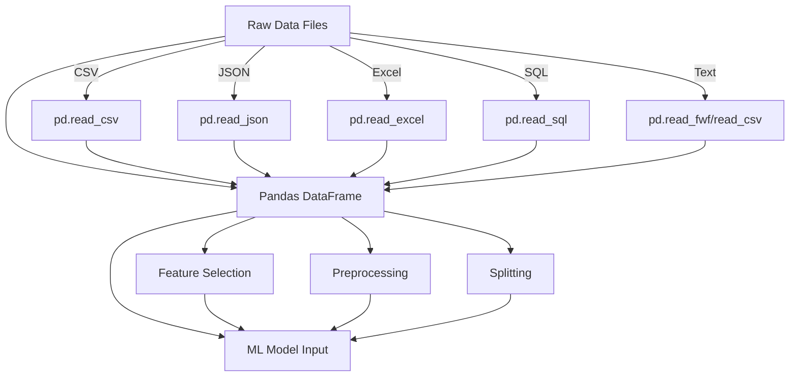
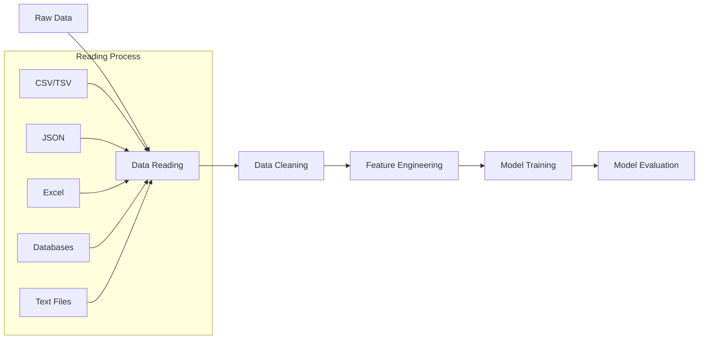
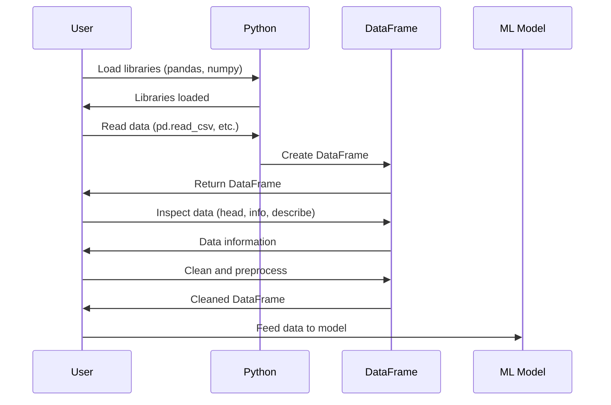

# Data Reading in Machine Learning

## Introduction

Data is the foundation of any machine learning project. Before you can train models or extract insights, you need to know how to properly read, load, and prepare your data. This lesson covers the essential techniques for reading different file formats and converting them into structures suitable for machine learning.

## Table of Contents

1. [Understanding DataFrames and Series](#understanding-dataframes-and-series)
2. [Reading CSV Files](#reading-csv-files)
3. [Reading JSON Files](#reading-json-files)
4. [Reading Excel Files](#reading-excel-files)
5. [Reading Text Files](#reading-text-files)
6. [Reading from Databases](#reading-from-databases)
7. [Reading Time Series Data](#reading-time-series-data)
8. [Converting Between Formats](#converting-between-formats)
9. [Handling Large Datasets](#handling-large-datasets)
10. [Summary and Best Practices](#summary-and-best-practices)

## Understanding DataFrames and Series

Before diving into file formats, let's understand the two fundamental data structures in pandas:

### Series

A Series is a one-dimensional labeled array that can hold data of any type (integers, strings, floating-point numbers, etc.).

```python
import pandas as pd

# Creating a Series
s = pd.Series([1, 2, 3, 4, 5], index=['a', 'b', 'c', 'd', 'e'])
print(s)
```

Output:
```
a    1
b    2
c    3
d    4
e    5
dtype: int64
```

### DataFrame

A DataFrame is a two-dimensional labeled data structure with columns that can be of different types. It's like a spreadsheet or SQL table.

```python
# Creating a DataFrame
data = {
    'Name': ['John', 'Anna', 'Peter', 'Linda'],
    'Age': [28, 34, 29, 42],
    'City': ['New York', 'Paris', 'Berlin', 'London']
}

df = pd.DataFrame(data)
print(df)
```

Output:
```
    Name  Age      City
0   John   28  New York
1   Anna   34     Paris
2  Peter   29    Berlin
3  Linda   42    London
```

## Reading CSV Files

CSV (Comma-Separated Values) is one of the most common formats for storing tabular data.

### Basic CSV Reading

```python
import pandas as pd

# Reading a CSV file
df = pd.read_csv('data.csv')

# Displaying the first 5 rows
print(df.head())
```

### Advanced CSV Reading Options

```python
# Reading with specific delimiter
df = pd.read_csv('data.csv', delimiter=';')

# Skipping rows
df = pd.read_csv('data.csv', skiprows=2)

# Specifying column names
df = pd.read_csv('data.csv', names=['col1', 'col2', 'col3'])

# Reading only specific columns
df = pd.read_csv('data.csv', usecols=['Name', 'Age'])

# Handling missing values
df = pd.read_csv('data.csv', na_values=['NA', 'Missing'])
```

## Reading JSON Files

JSON (JavaScript Object Notation) is a lightweight data-interchange format.

```python
# Reading a JSON file
df = pd.read_json('data.json')

# Reading nested JSON
df = pd.json_normalize(json_data)

# Reading JSON from URL
import requests
response = requests.get('https://api.example.com/data')
df = pd.read_json(response.text)
```

Example JSON data and resulting DataFrame:

JSON:
```json
[
  {"name": "John", "age": 30, "city": "New York"},
  {"name": "Anna", "age": 22, "city": "Paris"},
  {"name": "Peter", "age": 45, "city": "London"}
]
```

DataFrame:
```
    name  age      city
0   John   30  New York
1   Anna   22     Paris
2  Peter   45    London
```

## Reading Excel Files

```python
# Reading an Excel file
df = pd.read_excel('data.xlsx')

# Reading a specific sheet
df = pd.read_excel('data.xlsx', sheet_name='Sheet2')

# Reading multiple sheets
all_dfs = pd.read_excel('data.xlsx', sheet_name=None)
```

## Reading Text Files

```python
# Reading a simple text file
with open('data.txt', 'r') as file:
    data = file.read()
    
# Reading a space-delimited file
df = pd.read_csv('data.txt', delim_whitespace=True)

# Reading a fixed-width file
df = pd.read_fwf('data.txt', widths=[5, 3, 10])
```

## Reading from Databases

```python
import sqlite3
import pandas as pd

# Connecting to SQLite database
conn = sqlite3.connect('database.db')

# Reading data from SQL query
df = pd.read_sql_query("SELECT * FROM users", conn)

# Reading an entire table
df = pd.read_sql_table("users", conn)

# Closing the connection
conn.close()
```

## Reading Time Series Data

Time series data requires special handling to ensure dates are properly parsed.

```python
# Reading time series data from CSV
df = pd.read_csv('timeseries.csv', parse_dates=['date_column'])

# Setting the date column as index
df = pd.read_csv('timeseries.csv', parse_dates=['date_column'], index_col='date_column')

# Resampling time series data
daily_data = df.resample('D').mean()  # Resample to daily frequency
```

Example of a time series DataFrame:

```
            temperature  humidity
date                              
2023-01-01         22.5        45
2023-01-02         23.1        42
2023-01-03         21.8        50
2023-01-04         20.5        55
```

## Converting Between Formats

Sometimes you need to convert data between different formats for your ML pipeline.

```python
# CSV to DataFrame to JSON
df = pd.read_csv('data.csv')
df.to_json('data.json')

# Excel to CSV
df = pd.read_excel('data.xlsx')
df.to_csv('data.csv')

# DataFrame to NumPy array (for ML models)
import numpy as np
array = df.values
```

## Data Structure Visualization



## Data Flow in ML Pipeline



## Handling Large Datasets

When working with datasets that are too large to fit into memory, you can use chunking:

```python
# Reading large CSV files in chunks
chunks = pd.read_csv('large_data.csv', chunksize=10000)

# Processing each chunk
for chunk in chunks:
    # Process the chunk
    processed_chunk = some_processing_function(chunk)
    # Maybe append to a results file
    processed_chunk.to_csv('results.csv', mode='a', header=False)
```

You can also use libraries like Dask or Vaex for out-of-memory data processing:

```python
import dask.dataframe as dd

# Reading a large CSV with Dask
ddf = dd.read_csv('large_data.csv')

# Perform operations that will be executed lazily
result = ddf.groupby('column').mean().compute()
```

## Summary and Best Practices

1. **Choose the right import function** based on your file format
2. **Check your data** after loading with `.head()`, `.info()`, and `.describe()`
3. **Handle missing values** explicitly during import with `na_values`
4. **Optimize memory usage** with `dtype` parameters for large datasets
5. **Use chunking** for datasets too large to fit in memory
6. **Parse dates correctly** when working with time series data

## Common Data Reading Pattern



## Practical Exercise

Try reading different file formats with the knowledge you've gained:

1. Find a CSV dataset online (e.g., from Kaggle)
2. Read it into a pandas DataFrame
3. Examine the data using `.head()`, `.info()`, and `.describe()`
4. Convert it to a different format (e.g., JSON or Excel)
5. Read it back using the appropriate function
6. Verify that the data remains the same

## Next Steps

Now that you understand how to read data from various file formats, you're ready to move on to the next lesson on Data Collection, where you'll learn how to gather data from different sources including web scraping, APIs, and databases.
